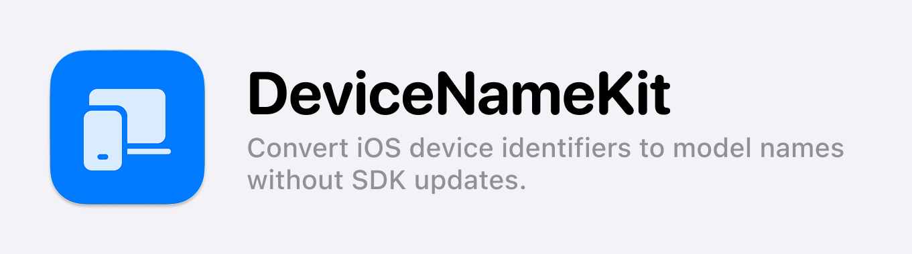

**DeviceNameKit** is a lightweight SDK that converts **device identifiers** into **commercial model names** on iOS, macOS, watchOS, tvOS, and visionOS. It maintains up-to-date device information without requiring SDK updates and supports caching to prevent unnecessary server requests.

[`Click here`](README_ko.md) to view the document in Korean.

## Supported Platforms

| OS       | Minimum Version |
| -------- | --------------- |
| iOS      | 13.0+           |
| macOS    | 11.0+           |
| watchOS  | 6.0+            |
| tvOS     | 13.0+           |
| visionOS | 1.0+            |

## Installation

### Swift Package Manager (SPM)

1. In Xcode, go to `File > Add Packages...`
2. Enter the following URL to add the package:
   ```
   https://github.com/kimdaehee0824/DeviceNameKit.git
   ```
3. After adding the dependency, you can use `import DeviceNameKit` to access DeviceNameKit.

## Usage

### Basic Device Model Name Conversion

```swift
import DeviceNameKit

let fetcher = DeviceNameFetcher(cachePolicy: .oneDay)

Task {
    let modelName = try await fetcher.getDeviceName()
    print("Device Model Name: \(modelName)") // Example: iPhone 15 Pro
}
```

### Completion Handler Approach

```swift
fetcher.getDeviceName { result in
    switch result {
    case .success(let modelName):
        print("Device Model Name: \(modelName)")
    case .failure(let error):
        print("Error: \(error.localizedDescription)")
    }
}
```

### Using Combine API

```swift
import Combine

let cancellable = fetcher.getDeviceNamePublisher()
    .sink(receiveCompletion: { completion in
        if case .failure(let error) = completion {
            print("Error: \(error)")
        }
    }, receiveValue: { modelName in
        print("Device Model Name: \(modelName)")
    })
```

### Using `preload()` for Preloading

Calling `preload()` at initialization allows the SDK to fetch the commercial model name from the server in advance.

```swift
let fetcher = DeviceNameFetcher(cachePolicy: .threeDays)
fetcher.preload() // Optimize performance by preloading at app launch
```

### Accessing Model Name via `deviceModel`

After calling `preload()`, the model name can be accessed as a `String` value. If the server request is not completed or fails, `nil` is returned.

```swift
print("Current Device Model Name: \(fetcher.deviceModel ?? "Unknown")")
```

## How It Works

1. **Retrieve Device Identifier**: The SDK fetches the device identifier using `uname()` or `sysctlbyname("hw.model")`.
2. **Map to Device Model Name**: The latest model name is obtained from a JSON dataset stored in a GitHub repository.
3. **Apply Caching (Optional)**: The SDK fetches the latest data by default, but caching can be enabled for performance optimization.

## Caching Policies

| Policy                     | Description                |
| -------------------------- | -------------------------- |
| `.noCache`                 | Always fetch the latest data |
| `.oneDay`                  | Cache data for 1 day       |
| `.threeDays`               | Cache data for 3 days      |
| `.sevenDays`               | Cache data for 7 days      |
| `.oneMonth`                | Cache data for 1 month     |
| `.custom(TimeInterval)`    | Custom caching duration    |

### Example of Applying Caching

```swift
let fetcher = DeviceNameFetcher(cachePolicy: .threeDays)
```

## Contribution Guidelines

1. Use the `Issues` tab for bug reports and feature requests.
2. Share new feature ideas in `Discussions`.
3. Steps for contributing via PR:
   - Fork the repository.
   - Create a new branch (`feature/new-feature`).
   - Develop and submit a pull request (PR).

> [!NOTE]
> If this repository updates slowly, you can fork and maintain your own updated version.

## License

This project is distributed under the MIT License. See [`LICENSE`](LICENSE) for more details.

