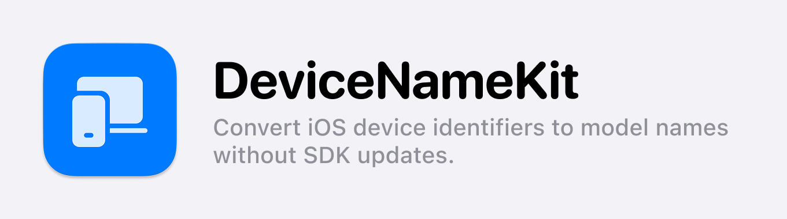

> You can view the document in different languages: [English](README.md), [한국어](README_ko.md), [日本語](README_jp.md)

**DeviceNameKit** は、Appleデバイスの**識別子（Device Identifier）を商用モデル名（Device Model Name）に変換する強力なSDK**です。iPhone、iPad、Mac、Apple Watch, Apple TV, Vision Proを含むすべてのAppleプラットフォームをサポートし、最新のデバイス情報を自動でマッピングすることで直感的なモデル名を提供します。

このライブラリは、Appleの内部デバイス識別子（例: `iPhone15,2`）をユーザーフレンドリーな製品名（例: `iPhone 14 Pro`）に変換します。さらに、**UserDefaultsを利用したキャッシュ機能**を備えており、不必要なネットワークリクエストを最小限に抑え、パフォーマンスを最適化します。

**DeviceNameKit** は複数のデータ取得方法を提供し、開発者が最適な方法を選択できます。

- **async/await対応:** Swift Concurrencyを活用し、直感的な非同期処理を実現
- **Completion Handler対応:** 柔軟なデータ取得が可能な従来のコールバック方式
- **Combine API対応:** `Future` を利用したリアクティブデータフローを実装
- **キャッシュ機能:** デバイスモデルデータを保存し、API呼び出しの回数を削減
- **安定したデータ取得:** `getSafeDeviceName()` メソッドにより、ネットワークエラー発生時でもアプリの動作を保証（識別子を返却）

本SDKは、**デバイスごとの設定適用、ログ分析、A/Bテスト、カスタマーサポートメール作成**など、デバイスモデル名を正確に認識する必要がある場面で役立ちます。

デモアプリの詳細は [こちら](https://github.com/kimdaehee0824/DeviceNameKit_Demo) をご覧ください。

## 対応プラットフォーム

| OS       | 最低対応バージョン |
| -------- | ------------------ |
| iOS      | 13.0+              |
| macOS    | 11.0+              |
| watchOS  | 6.0+               |
| tvOS     | 13.0+              |
| visionOS | 1.0+               |

## インストール方法

### Swift Package Manager (SPM)

1. Xcodeのメニューから `File > Add Packages...` を選択
2. 以下のURLを入力し、パッケージを追加:
   ```
   https://github.com/kimdaehee0824/DeviceNameKit.git
   ```
3. 依存関係を追加した後、DeviceNameKitを以下のようにインポート:
   ```swift
   import DeviceNameKit
   ```

## 使い方

### 1. 基本的なデバイスモデル名変換（async/await）
```swift
let fetcher = DeviceNameFetcher(cachePolicy: .oneDay)

Task {
    do {
        let modelName = try await fetcher.getDeviceName()
        print("Device Model Name: \(modelName)") // 例: iPhone 15 Pro
    } catch {
        print("Error: \(error.localizedDescription)")
    }
}
```

### 2. Completion Handlerを使用
```swift
let fetcher = DeviceNameFetcher(cachePolicy: .oneDay)

fetcher.getDeviceName { result in
    switch result {
    case .success(let modelName):
        print("Device Model Name: \(modelName)")
    case .failure(let error):
        print("Error: \(error.localizedDescription)")
    }
}
```

### 3. Combine APIを使用
```swift
import Combine

let fetcher = DeviceNameFetcher(cachePolicy: .oneDay)

let cancellable = fetcher.getDeviceNamePublisher()
    .sink(receiveCompletion: { completion in
        if case .failure(let error) = completion {
            print("Error: \(error)")
        }
    }, receiveValue: { modelName in
        print("Device Model Name: \(modelName)")
    })
```

### 4. エラーを発生させない `getSafeDeviceName()`
`getSafeDeviceName()` を使用すると、エラー発生時にも元のデバイス識別子を返すため、エラーハンドリングが不要になります。

```swift
let fetcher = DeviceNameFetcher(cachePolicy: .oneDay)

Task {
    let modelName = await fetcher.getSafeDeviceName()
    print("Device Model Name: \(modelName)")
}
```
このメソッドは内部で `os.log` を使用してエラーを記録しながら、識別子を返却します。

### 5. `preload()` を利用した事前読み込み
`preload()` を呼び出すことで、デバイスモデル名を事前に取得し、キャッシュできます。

```swift
let fetcher = DeviceNameFetcher(cachePolicy: .threeDays)
fetcher.preload() // アプリ起動時に事前読み込みを行い、パフォーマンス最適化
```

### 6. `deviceModel` プロパティを利用
`preload()` の後、一定時間経過後に `deviceModel` から直接取得可能。サーバー通信が完了していない場合は `nil` を返します。

```swift
print("Current Device Model Name: \(fetcher.deviceModel ?? "Unknown")")
```

## キャッシュポリシー

| ポリシー | 説明 |
|---|---|
| `.noCache` | 常に最新のデータを取得 |
| `.oneDay` | 1日間キャッシュ |
| `.threeDays` | 3日間キャッシュ |
| `.sevenDays` | 7日間キャッシュ |
| `.oneMonth` | 1ヶ月間キャッシュ |
| `.custom(TimeInterval)` | カスタムキャッシュ時間を設定可能 |
| `.forever` | 永続的にキャッシュ |

### キャッシュ適用方法
```swift
let fetcher = DeviceNameFetcher(cachePolicy: .threeDays)
```

## エラーハンドリング

`DeviceNameFetcherError` enum により、エラーの詳細を取得可能。

```swift
public enum DeviceNameFetcherError: Error {
    case fetchFailed(deviceIdentifier: String, underlyingError: Error)
}
```
エラー発生時は `deviceIdentifier`（例: "iPhone17,4"）と `underlyingError` を確認できます。

## 動作原理
1. **デバイス識別子の取得:** `uname()` または `sysctlbyname("hw.model")` を使用
2. **デバイスモデル名のマッピング:** GitHubリポジトリのJSONデータを参照して最新のモデル名を取得

## コントリビューション

1. `Issues` タブでバグ報告や機能リクエストを受け付けています。
2. Pull Requestは歓迎します。新機能や改善提案があればレビューの上、反映します。

## ライセンス

本プロジェクトはMITライセンスの下で配布されています。詳細は[`LICENSE`](LICENSE)ファイルをご確認ください。
